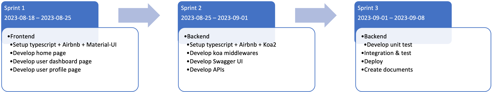

[](https://codecov.io/gh/a1234321606/auth0_backend)

# Backend for Auth0 Demo
This project is a basic backend APIs created for demonstrating and learning Auth0. Throughout this project, I've swiftly acquired and applied the new techniques, `Auth0` and `typescript`, in around one week as shown in the timesheet figure.



# Demo
Here's a quick overview of how to use Swagger. You can access the Swagger UI [here](https://backend-1ovz.onrender.com/api/swagger). To access the Swagger, you must first sign up by email on our [frontend service](https://portal-bpu0.onrender.com). After signing up, use your email and password to log in to Swagger.\
Please be aware that our backend service is deployed on Render, which comes with a [limitation](https://render.com/docs/free#free-web-services). It may spin down the service after 15 minutes of inactivity, and it resumes service within a few seconds when a request is made. This might result in a delay for incoming requests.


# Feature
* Provision of user APIs for [frontend](https://github.com/a1234321606/auth0_web) access.
* Availability of Swagger for API testing.
* Comprehensive unit tests to maintain high code quality, with a coverage rate of 95%.
* Adherence to Airbnb's coding standards, ensuring clean and consistent code.

# How to use
* Auth0
  * Signup [Auth0](https://auth0.com/) and create an application
  * Add an action to login flow
    * `name` & `email` are used for email notification
    * `last_login` is used for user statistics feature

      ```js
      exports.onExecutePostLogin = async (event, api) => {
      const { user } = event;
      const namespace = "https://custom.claim"

      if (event.authorization) {
          api.idToken.setCustomClaim(`${namespace}/name`, user.user_metadata?.name || user.name);
          api.accessToken.setCustomClaim(`${namespace}/name`, user.user_metadata?.name || user.name);
          api.accessToken.setCustomClaim(`${namespace}/email`, user.email);
          api.user.setUserMetadata("last_login", Date.now());
      }
      };
      ```
* SMTP service
  * Get [application password](https://support.google.com/accounts/answer/185833) for Gmail SMTP service
* Environment setup
  * Add Auth0 & Google secrets to the `.env` file
  * Install packages: `npm i`
  * Start service: `npm start`