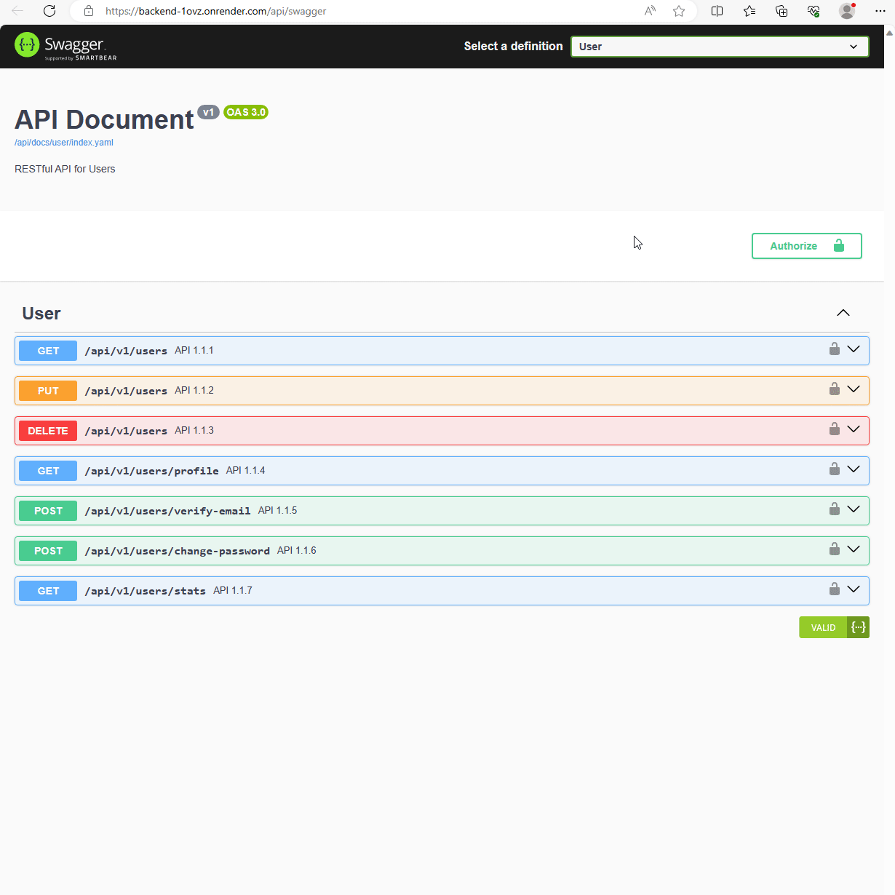

[](https://codecov.io/gh/a1234321606/auth0_backend)

# Backend for Auth0 Demo
The goal of this project is to create several APIs, so users can access the dahboard and profile after users sign in. In this project, I've swiftly acquired and applied the new techniques, `Auth0`, `Retool` and `typescript`, in around one week as shown in the timesheet figure.


# Technology Stacks
- Language: NodeJS, Typescript
- 3rd-Party services/packages: Auth0, Gmail, Koa2
- Database: Retool
- Coding Stlyes: Airbnb
- API Design: Swagger
- Hosting: [Render](https://render.com)

# Features
- ✅ Sign up
  - Managed by Auth0
- ✅ User Defined Password
  - Verify password and send password change email by `/users/change-password` POST API
- ✅ Email Verification
  - Auth0 will send verification email when users sign up
  - Send verification email by `/users/verify-email` POST API when users change their emails
- ✅ Login
  - Managed by Auth0
- ✅ User Profile
  - Get profile data by  `/users/profile` GET API
  - Update profile data by `/users` PUT API
- ✅ Cookies and Logout
  - Managed by Auth0
- ✅ User Database Dashboard
  - Get user list by `/users` GET API
- ✅ User Statistics
  - Get statistics data by `/users/stats` GET API
- ✅ [Extra] Delete user account
  - Delete user by `/users` DELETE API
- ✅ [Extra] Unit test
  - Comprehensive unit tests to maintain high code quality, with a coverage rate of 95%.
      

# Demo
Here's a quick overview of how to use Swagger. You can access the Swagger UI [here](https://backend-1ovz.onrender.com/api/swagger). To access the Swagger, you must first sign up by email on our [frontend service](https://portal-bpu0.onrender.com). After signing up, use your email and password to log in to Swagger.

Please be aware that our backend service is deployed on Render, which comes with a [limitation](https://render.com/docs/free#free-web-services). It may spin down the service after 15 minutes of inactivity, and it resumes service within a few seconds when a request is made. This might result in a delay for incoming requests.



# How to Use
* [Retool](https://retool.com)
  * Create a table named `auth0_session_logs` in Retool DB
  * Create a webhook in workflow for Auth0 adds session data to Retool DB
* [Auth0](https://auth0.com)
  * Create a `machine to machine application` for client crediencials flow
  * Create email provider
  * Create email templates
    * Verification Email (using Link)
    * Change Password (Acutally, this is reset password when user click forgot password link)
  * Add an action to login flow
    * `name` & `email` are used for email notification
    * `last_login` is used for user statistics feature
    * Add `retool_workflow_id` & `retool_workflow_key` to secrets
    * Add `axios` to dependencies

      ```js
      exports.onExecutePostLogin = async (event, api) => {
        const { user } = event;
        const namespace = "https://custom.claim";
        const axios = require('axios');

        if (event.authorization) {
          const ts = Date.now();

          api.idToken.setCustomClaim(`${namespace}/name`, user.user_metadata?.name || user.name);
          api.accessToken.setCustomClaim(`${namespace}/name`, user.user_metadata?.name || user.name);
          api.accessToken.setCustomClaim(`${namespace}/email`, user.email);
          api.user.setUserMetadata("last_login", ts);

          const url = `https://api.retool.com/v1/workflows/${secrets.retool_workflow_id}/startTrigger?workflowApiKey=${secrets.retool_workflow_key}`;
          axios.post(url, { user_id: user.user_id, timestamp: ts });
        }
      };
      ```
* Gmail SMTP
  * Get [application password](https://support.google.com/accounts/answer/185833)
* Environment setup
  * Add Auth0, Retool DB & Google secrets to `.env` file
  * Install packages: `npm i`
  * Run testing: `npm test`
  * Start service: `npm start`
